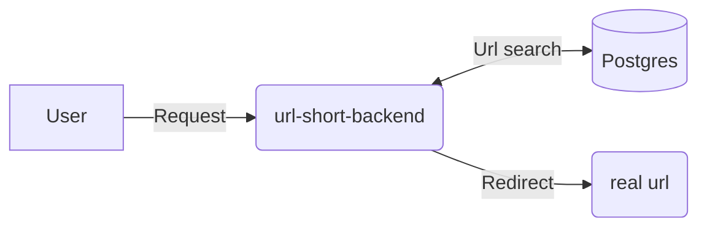

# url-short-back

## Content
1. [About](#about)
2. [Architecture](#architecture)
3. [Stack](#stack)
4. [Install](#install)

## About

This is a backend for a url shortener, this a project for learning and aplying previous knowledge, while i know most of the things in the stack are not for production ready or experimental, i want to avoid work burnout using diferent libraries or frameworks :

## Architecture

- Clean architecture


## Stack

- Bun
- Typescript
- Fastify
- JWT
- Drizzle ORM
- Postgres

## Install 

To install dependencies:

```bash
bun install
```

To run:

```bash
bun run index.ts
```

This project was created using `bun init` in bun v1.2.16. [Bun](https://bun.sh) is a fast all-in-one JavaScript runtime.
